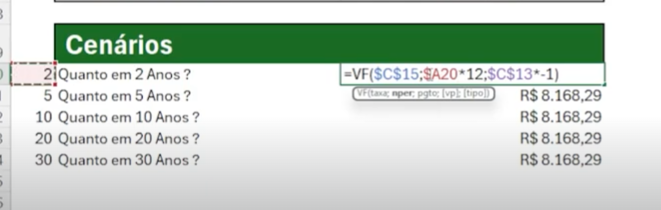
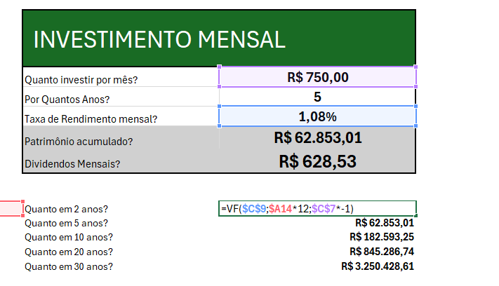
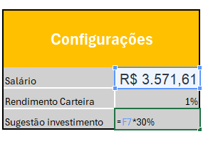
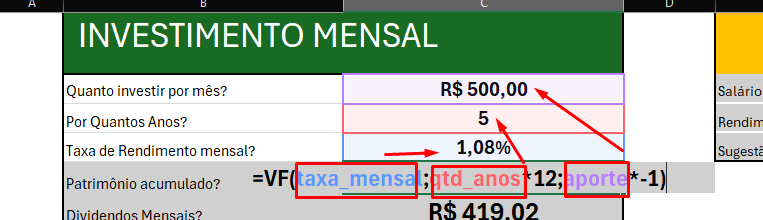
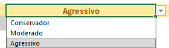

# Excel com Inteligencia Aritifical Repo local

Repositório para entregar aula 
"Criando uma Ferramenta de Controle de Investimentos com Excel"

[Link para o repo:](https://github.com/willgilg/excel-santander)

- [Documentação Git]

## Resumo das aulas

| Formulas  | Explicação |
|-------|---------|
|=VF(C9;C8*12;C7*-1 | VF (Valor Futuro) | C15 (Juros) | C14 (Anos × 12) | C13 (Valor Mensal) | -1 (Inverter sinal negativo)|
|=PROCV(G3;$A:$D;4;FALSO) | PROCV = G3 = VALOR PROCURADO; $A:$D = COLUNAS DA COLUNA A ATÉ D;  4 = COLUNA 4; FALSO = CORRESPONDENCIA EXATA|

  *VF = VALOR FUTURO
  *C15 = JURUS
  *C14 = ANOS X 12 = 5X 12 PRA DAR 5 ANOS
  *C13 = VALOR POR MES
  *-1 = PARA NÃO DAR NEGATIVO, POIS POR PADRÃO O EXECEL CONSIDERA O VF COMO SAIDAS

```
=VF(C9;C8*12;C7*-1)
```


  *DIVIDENDOS
  *PATRIMONIO ACUMULADO
  *X 1% 


## Dica para utilizar numeros "invisíveis" no Excel 
  *COLOQUE OS NUMEROS NA COLUNA AO LADO 

  *PINTE OS DE BRANCO PARA USAR O VALOR NA FORMULA
  *APERTE F4 DUAS VEZES PARA FICAR A$20 = ISSO FAZ QUE SEJA POSSIVEL COPIAR A FORMULA ARRASTANDO PARA BAIXO DEM ALTERAR OS NUMEROS DAS COLUNAS QUE VOCE VAI DEIXAR INIVISEVEL
{{:pasted:20251216-163604.png}}

  *Meus cenarios


### SUGESTÃO DE INVESTIMENTO 
  *30% DO SALARIO
{{:pasted:20251218-163702.png}}\\


### VARIAVEIS GLOBAIS NOMEAÇÃO DE INTERVALOS \ CELULAS

  *Vá no canto superior esquerdo e de um nome a célula 
\\
  *Aperte a tecla F3 para ABRIR OS NOMES DAS VARIAVEIS



## PERFIS DE INVESTIMENTO 


### PERFIS DE INVESTIMENTO DINAMICO
  *1 - Criar campo de texto validado com Conservador;Moderado;Agressivo

  *2 - Criar um tabela de apoio para pegar os com os valores PERCENTUAIS e os tipos de FII's
   
  *3 - O valor da coluna A é o concatenação dos valores da coluna B e C "=B3&"-"&C3" para que fique o texto seja "**TIPO-DE-FI-PERCENTUAL SUGERIDO**"
  *Isso é chamado de chave composta



  *4 - Criar um PROCV da planilha de apoio no campo de texto "Percentual sugerido"
  *Correspondência exata = FALSO
  *PROCV =  
  ```
  =PROCV(G3;$A:$D;4;FALSO)
  ```

    *Explicação PROCV 
  *PROCV = G3 = VALOR PROCURADO; $A:$D = COLUNAS DA COLUNA A ATÉ D;  4 = COLUNA 4; FALSO = CORRESPONDENCIA EXATA


  *5 - Criar procv junto a formula de concatenação na columa Percentual Suegerido,
  *Ficando:
  *=PROCV($C$25&"-"&B29;Planilha2!$A:$D;4;FALSO)
  *Formula da concatanação + PROCV 
