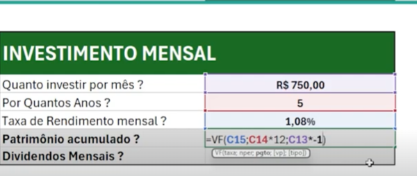
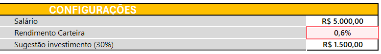
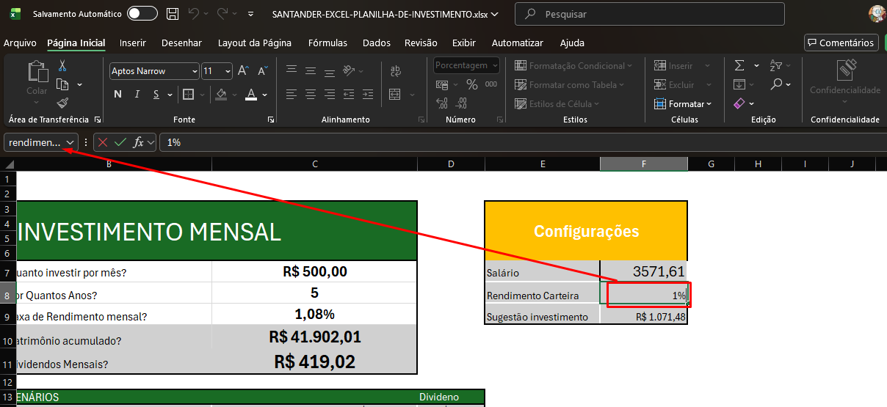
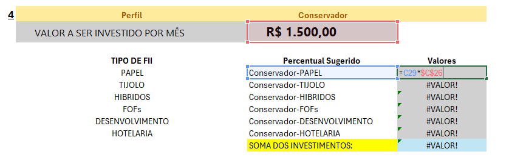
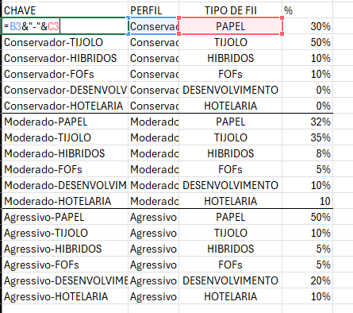
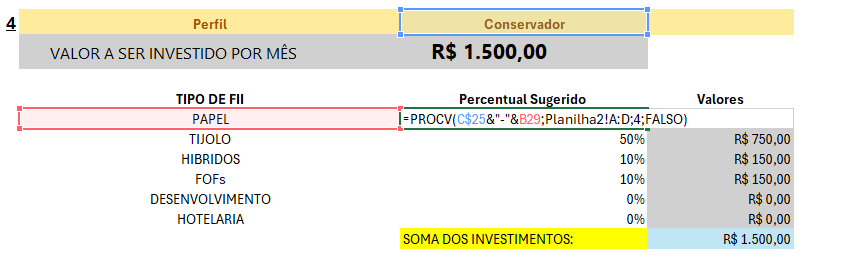
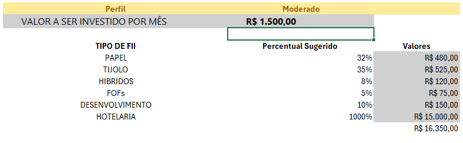

# Excel com Inteligencia Aritifical - Entrega de projeto

Repositório para entregar aula 
"Criando uma Ferramenta de Controle de Investimentos com Excel"

A planilha está dividida em 4 partes:

1. ⚙️ Configurações
Área centralizadora onde o usuário define os parâmetros base da simulação.
Definição de aporte inicial, taxa de juros estimada e metas.

2. 📅 Investimento Mensal
O Campo "Quanto investir por mês?" - É independente do valor segestionado nas "Configurações"
Uma visão detalhada do cenário anual 
Acompanhamento mês a mês da evolução dos aportes.

Cálculo de juros compostos aplicados ao fluxo de caixa de curto prazo.

3. ⏳ Cenários de Longo Prazo
Simulações projetadas para horizontes de 2 a 30 anos.
Patrimônio Acumulado  e cálculo automático de renda passiva dividendos mensais estimados com base no montante acumulado.

4. 🏢 Perfis de Investimento Imobiliário (FIIs)
Análise segmentada por categorias de fundos, permitindo comparar diferentes estratégias de acordo com o perfil de investimento do usuário
Os Valores apresentados são recomendados a serem investido em cada categoria


[Link para o repo:](https://github.com/willgilg/excel-santander)

- [Documentação Git]

### Formulas do Excel utilizadas na aula
| Formulas  | Explicação |
|-------|---------|
|=VF(C9;C8*12;C7*-1)| VF (Valor Futuro) C9 (Juros) C18 (Anos × 12)  C7 (Valor Mensal)  Vezes -1 (Para Inverter sinal negativo)|
|=PROCV(G3;$A:$D;4;FALSO) | PROCV = G3 = VALOR PROCURADO; $A:$D = COLUNAS DA COLUNA A ATÉ D;  4 = COLUNA 4; FALSO = CORRESPONDENCIA EXATA|

## 1 INVESTIMENTO MENSAL - Calculando valor futuro (Patrimonio acumulado)


```
=VF(C9;C8*12;C7*-1)
```


## 2 - Menu de configurações
O Campo "Quanto investir por mês?" - É independente do valor segestionado nas "Configurações"


## 2.1 Calculando dividendos mensais 

Dividendos = Patrimonio acumulado * 1% 


```
Dividendos = Patrimonio acumulado * 1% 
```
```
=patrimonio*rendimento_carteira
```

## 3 CENÁRIOS - Dica para utilizar numeros "invisíveis" no Excel 
  *COLOQUE OS NUMEROS NA COLUNA AO LADO 


PINTE OS DE BRANCO PARA USAR O VALOR NA FORMULA

APERTE F4 DUAS VEZES PARA FICAR A$20 = ISSO FAZ QUE SEJA POSSIVEL COPIAR A FORMULA ARRASTANDO PARA BAIXO DEM ALTERAR OS NUMEROS DAS COLUNAS QUE VOCE VAI DEIXAR "INIVISEVEL"

Formula do valor futuro com valores fixos baseados nos numeros ocultos
```
=VF($D$14;$A19*12;$D$12*-1)
```

#### DICA: VARIAVEIS GLOBAIS NOMEAÇÃO DE INTERVALOS \ CELULAS
> [!TIP]
>Dica para melhor organização da planilha, definir nomes nas células
>Vá no canto superior esquerdo e de um nome a célula 
>Aperte a tecla F3 para ABRIR OS NOMES DAS VARIAVEIS



### 4 PERFIS DE INVESTIMENTO DINAMICO 
  *1 - Criar campo de texto validado na segunda Coluna com:
```
Conservador;Moderado;Agressivo;
```
  *Aperte a tecla F3 para ABRIR OS NOMES DAS VARIAVEI
  *2 - Criar um tabela de apoio para pegar os com os valores PERCENTUAIS e os tipos de FII's
   
  *3 - O valor da coluna A é o concatenação dos valores da coluna B e C "=B3&"-"&C3" para que fique o texto seja "**TIPO-DE-FI-PERCENTUAL SUGERIDO**"

  *Isso é chamado de chave composta

  *Esse campo será utilizado com outra formula para que os valores de acordo com cada perfil seja encontrado em outra planilha



## 4.1  Na planilha2 Formula da concatanação + PROCV na segunda "Planilha2"
  *Criar segunda planilha para armazenar variaveis

  *Somente dados são armazenados nessa planilha, cole os dados da Planilha1 utilizando CTRL + ATL + V




## 4.2 - Na planilha1 - Criar um PROCV da planilha de apoio no campo de texto "Percentual sugerido"
  Correspondência exata = FALSO

## 4.3 - PROCV + CONCATENAÇÃO
```
=PROCV(C$25&"-"&B29;Planilha2!A:D;4;FALSO)´
```


 
  *FORMULA PROCV SEPARADA
```
=PROCV(G3;$A:$D;4;FALSO)
```
> [!TIP]
> Explicação PROCV 
> PROCV = G3 = VALOR PROCURADO; 
> $A:$D = COLUNAS DA COLUNA A ATÉ D; 
> 4 = COLUNA 4; 
> FALSO = CORRESPONDENCIA EXATA


## 4.4 Cirar formula PROCV na "planilha1" 
  *5 - Criar procv junto a formula de concatenação na columa Percentual Suegerido,
  *Ficando:

```
=PROCV($C$25&"-"&B29;Planilha2!$A:$D;4;FALSO)
```

## 4.5 - Visualização final
